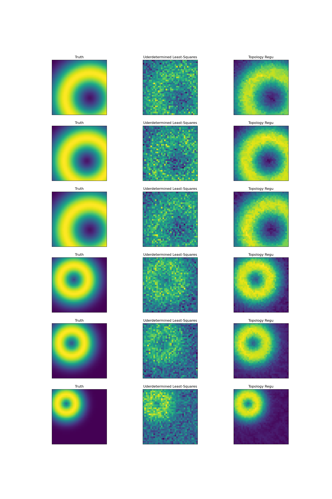

# PDGenLayers
This repository contains documentations and usage examples for PD layers of the paper
[PDGen: Enhancing Implicit Shape Generators Using Topological Regularizations](https://openreview.net/pdf?id=XBNhJQU84y)

## Citation
```
@inproceedings{chen2024pdgen,
  title={Enhancing Implicit Shape Generators Using Topological Regularizations},
  author={Chen, Liyan and Zheng, Yan and Li, Yang and Jagarapu, Lohit Anirudh and Li, Haoxiang and Kang, Hao and Hua, Gang and Huang, Qixing},
  booktitle={Forty-first International Conference on Machine Learning}
}
```

## Get Started
Our package has the following requirements:
 - Ubuntu >= 20.04
 - Python == 3.10
 - Pytorch == 1.13
 - libstdcxx-ng >= 12 (can be installed with conda-forge)

If you run into problems of missing `so` files, please install the corresponding packages through `apt-install` or `conda`.

### Install with pip
Locate an appropriate version of our package in our [[registry]](https://www.cs.utexas.edu/~liyanc/pyidx.cgi) and copy the url.
Install our PD layers through pip
```shell
pip install {url}
```

# API and Usage
Overall, we adhere to APIs provided by the [TopologyLayer](https://github.com/bruel-gabrielsson/TopologyLayer). 
As of now, we only focus on the levelset layers since that is the filtration used for functions (e.g., SDFs) of our PDGen.

## Training with Batched Levelset PD Layer
Our PD layer provides a batched levelset layer assuming the same lattice simplicial complex for the entire batch.
However, we don't prevent you from varying sampling range/density for each volume in the batch as long as you don't 
violate the orientedness of the underlying simplicial complex.

We provide a simple example to illustrate the batched levelset layer API. We generalized an underdetermined 
least-squares training with enforcing a 2D hole through our batched levelset layer to show the usage.
The example can be found at `examples/train_batched_levelset.py`.



Specifically, our batched levelset PD layer has the following signature:
```
# size: (width, height, depth) - size tuple for 3D volume sample array input dimensions
# is_sublevel: sublevel or superlevel persistence (for SDF, we shall use superlevel and set is_sublevel=False)
pdlayer = topologylayer.nn.BatchedLevelSetLayer3D(size, is_sublevel)
```

During forward pass, one can optionally specify a minimal persistence threshold to enable a sparse calculation optimization.
The minimal persistence threshold will remove PD points with `|birth - death| < min_pers` to save computation costs.
```
# batch_volume: a torch.Tensor with shape [B, W, H, D], B is batch size
# dgms: (h0, h1, h2): three homology group PD points with shape [B, N_i, 2]
dgms, flag = pdlayer(batch_volume, min_pers=0.01)
```

## Training with Wasserstein PD Distance
We provide an optimized Wasserstein PD Distance layer. The complete example can be found at `examples/train_pd_loss.py`.


Specifically, our Wasserstein PD Distance layer is optimized for computing the distance between lists of batched arrays
while propagating gradients to all inputs. Computations are highly parallelized across the list and the batch, so the more
points one packs in one call, the more throughput one can get up to a hardware limit.

One can construct a Wasserstein PD Distance layer in the following way:
```
# We support three norms: 'L1', 'L2', 'Squared L2'
wd = topologylayer.nn.WassersteinDistanceLayer(norm="L2")
```

During forward pass, we compute distances between two lists of tensors:
```
# Pts1, Pts2: List[torch.Tensor] of shape [(b1, m1, d), ...] and [(b1, n1, d), ...]
# dists: List[torch.Tensor]
dists = wd(Pts1, Pts2)
```
